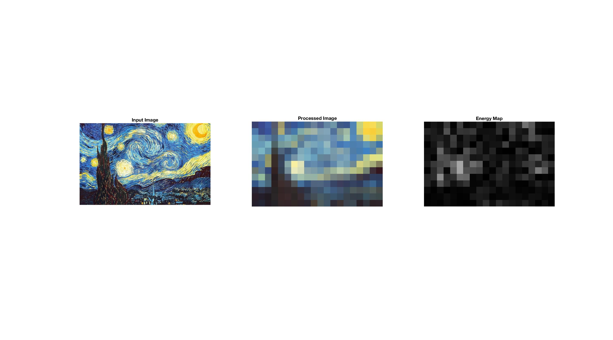

# MUSICAL REALIZATION OF IMAGES

**[Demo Video](http://cyxu.tv/portfolio/musical-realization-of-images)**

Audio visualization such as waveform and spectrogram is a common practice in audio recording and editing. In recent years, many creative forms of visualization presented online, made possible by programing in JavaScript and WebGL.

Audio and visual are two of the most important senses of human, and together they provide us the basic sensation of the intangible world around us. However, the reversed process, turning images into audio, is not as popular. One example I found of such practice is to encrypt image into audio files, merely using it as an alternative medium to transmit information. We often have shared feeling regarding images – warm and cold themes, simple geometry versus repeated patterns, all can be interpreted as feelings in sound or music.

## The design:

From what I learned in Digital Image Processing course, I am able to retrieve and manipulate visual information like color, contrast, and pattern from images. By matching these information to elements in sound synthesis – frequency, amplitude, and timbres, we can reproduce the image in sound. The process requires a lot fine tuning of the relationship and weight of each element.
The code is in Matlab. Each note will be generated by an open source oscillator. Hopefully this application can produce pleasant sound that might become a new way for people with vision impairment to enjoy paintings, and other images.

## Prerequisites
- Matlab 

## Getting Started
Run img2noise.m in Matlab, results are saved in `output` directory
